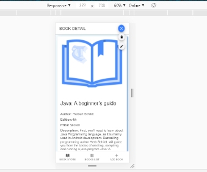

### This is simple Ionic Application (Book Store)which displays List of Books and Book Details and Functionality to Add New Book and to Remove Existing Book(This All Works Using Services and ID of Book is AUTO-GENERATED).

###This is Simple Tabs Page Work(Shows Tab on Bottom of Pages(fixed)), this home tab page that diplays book store name some image and note about books and in last it displays languages of android development on its click it navigate to that language learning page.

###This Tab Page Displays List of Available Books with Book Name, Author, Edition ,Description and Price along with floating button includes edit and delete book buttons and to check  Detail of any Book  from list just click it, it will navigate to next page and display that book details .

###This Displays Floating Button that onclick it float two more buttons to left of itself and that two buttons are of edit and delete books.

###This Tab Page Shows Detail of any selected book from Books List.

###On Book Detail Page on Top Right its a Floating Button that Floats to Bottom on Click and displays two more Buttons of Edit and Delte That Selected Book.

###This Tab Page Has Modal in which a Card displays a Form of adding new Book to list includes Book name, Author, Edition Price and Description of Book,and on Top Right of Page a Back Button exists that redirect to Home Tab Page.

###This shows that when click on delete button first it confirms by showing confirm dialogue(Alerter)with alert text and two button (Yes & No)if click yes then service of deletion call and it delets the selected book from list and then toaster show successful deletion message and if No Button clicks then toaster chow delete cancel message.

###This is Same Alerter(Delete Confirm Dialogue Box) in Tab Page in whick Book Detail displays it works same. except when successfully deletion toaster occur mean successfully deletion occur it navigates to previous(Book List Tab Page) otherwise show cancel toaster message and remains on that page.

###This Displays Toaster Message that confirms successfull deletion of selected book.

###This Displays Toaster Message that confirms Cancel of Deletion of selected book.

###Same Cancel Toaster of Book Detail Page.

###This is Add New Book Form that Get Info About New Book and (ID is AUTO-GENERATED).

###On Successfull Adition of New Book its shows Successfully Saved Message(Toaster).

###Display New Added Book in List.

###Display New Added Book Detail (onclick).

